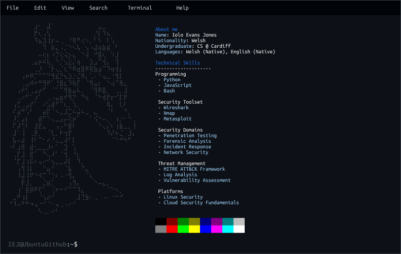

# Welcome to my GitHub Profile 👋

---

I'm an MSc student at Cardiff University studying Cybersecurity With Technology.

With 3 years experience in Python, JavaScript, React, and Node.js, I love researching anything and everything in cybersecurity.

On an average day you'll see me trying to hit the top 1000 on Tryhackme, or working on a new project.

I love collaborating on new technologies and projects with others, so if you have an idea, feel free to reach out!

---

